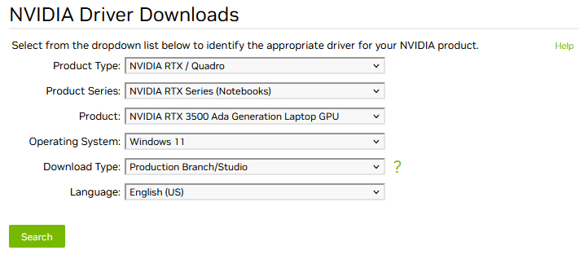
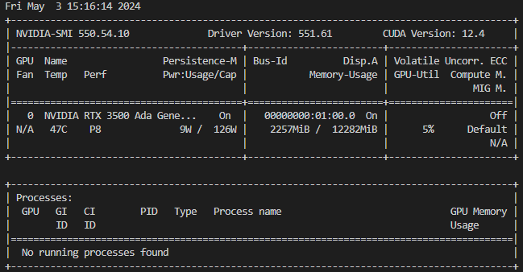

# Getting started with CUDA on WSL2
Tensorflow dropped the support for windows for all version of 2.11 and after, for most students windows is still a starting point.
This will give a brief explanation of how to setup CUDA for WSL2 and install all relevant packages / requirements.

## Usefull links
Most of the information is pulled straigt from a few sources, such as Tensorflow and CUDA themselves.

- [Tensorflow pip WSL2](https://www.tensorflow.org/install/pip)
- [CUDA WSL2 guide](https://docs.nvidia.com/cuda/wsl-user-guide/index.html)
- [CUDA WSL2 packages](https://developer.nvidia.com/cuda-downloads?target_os=Linux&target_arch=x86_64&Distribution=WSL-Ubuntu&target_version=2.0&target_type=deb_local)

### Drivers
First things first: we need to get our drivers! We can simply install them from [here](https://www.nvidia.com/Download/index.aspx). You should provide all relevant information as shown in the picture below.



Follow the instruction and continue to the next step.

### WSL2
To use wsl you obviously first have to install it!
To do so run this command ```wsl.exe --install``` in cmd or powershell with administrator privileges.
Ensure it has the most recent kernel ```wsl.exe --update``` and check out the [official guide](https://learn.microsoft.com/en-us/windows/wsl/install) from microsoft. **You should use something like Ubuntu-22.04**

### WSL2 in VSCode
VSCode offers seamless WSL integration using plugins (mainly [WSL](https://code.visualstudio.com/blogs/2019/09/03/wsl2)). You can then either open a VSCode instance from wsl by typing ```code .``` in the target dir. Or by using VSCode directly ```Connect to WSL```.

### Install CUDA
Now that we're in WSL using VSCode we can setup CUDA.

First remove the old GPG key ```sudo apt-key del 7fa2af80```. Then use the [official download package for WSL-Ubuntu](https://developer.nvidia.com/cuda-downloads?target_os=Linux&target_arch=x86_64&Distribution=WSL-Ubuntu&target_version=2.0&target_type=deb_local). If you need a different version than 12.4 check the [archive](https://developer.nvidia.com/cuda-toolkit-archive) (e.g. [11.8 for WSL2](https://developer.nvidia.com/cuda-11-8-0-download-archive?target_os=Linux&target_arch=x86_64&Distribution=WSL-Ubuntu&target_version=2.0&target_type=deb_local)).

For 12.4 run the following commands from within a WSL
~~~bash
wget https://developer.download.nvidia.com/compute/cuda/repos/wsl-ubuntu/x86_64/cuda-wsl-ubuntu.pin
sudo mv cuda-wsl-ubuntu.pin /etc/apt/preferences.d/cuda-repository-pin-600
wget https://developer.download.nvidia.com/compute/cuda/12.4.1/local_installers/cuda-repo-wsl-ubuntu-12-4-local_12.4.1-1_amd64.deb
sudo dpkg -i cuda-repo-wsl-ubuntu-12-4-local_12.4.1-1_amd64.deb
sudo cp /var/cuda-repo-wsl-ubuntu-12-4-local/cuda-*-keyring.gpg /usr/share/keyrings/
~~~

After the last command you might get an error message:

The public cuda-repo-wsl-ubuntu-12-4-local GPG key does not appear to be installed. To install the key, run this command:
```sudo cp /var/cuda-repo-wsl-ubuntu-12-4-local/cuda-38AF289B-keyring.gpg /usr/share/keyrings/```

This will differ depending on which CUDA version you want to install. Simply copy the command to run the command printed and continue!
~~~bash
sudo cp /var/cuda-repo-wsl-ubuntu-12-4-local/cuda-38AF289B-keyring.gpg /usr/share/keyrings/
sudo apt-get update
sudo apt-get -y install cuda-toolkit-12-4
~~~

### Verify and install packages
To see if everything is correctly installed you can run ```nvidia-smi``` which should print something like the below picture.



Then simply go into the venv you want to work in and run these commands

~~~bash
pip install --upgrade pip
pip install tensorflow[and-cuda]==2.14.0
python3 -c "import tensorflow as tf; print(tf.config.list_physical_devices('GPU'))"
~~~
You can also optionally install the requirements_3_10.txt file and run the *uebung10.py* and others to see if it works correctly.